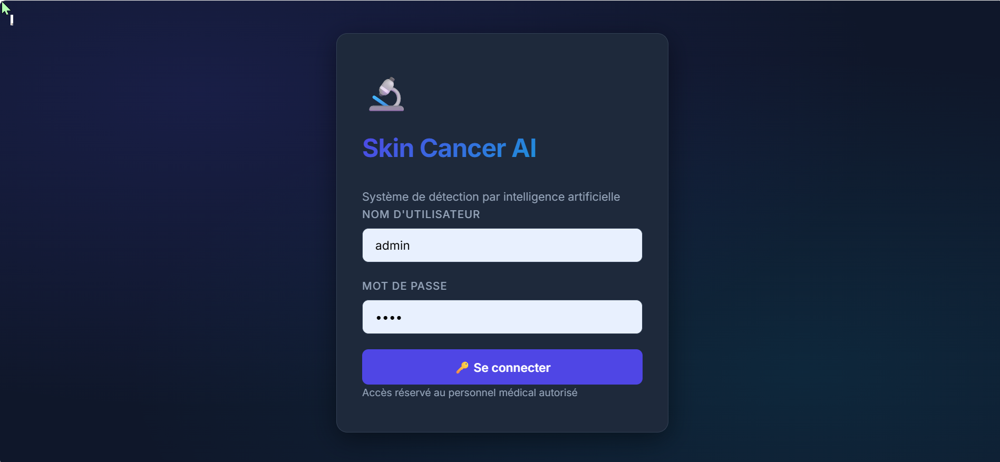
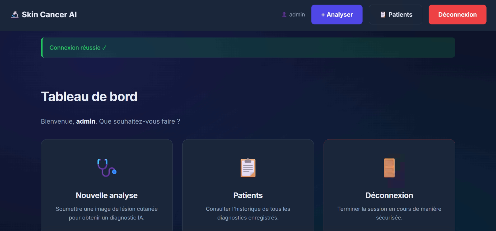
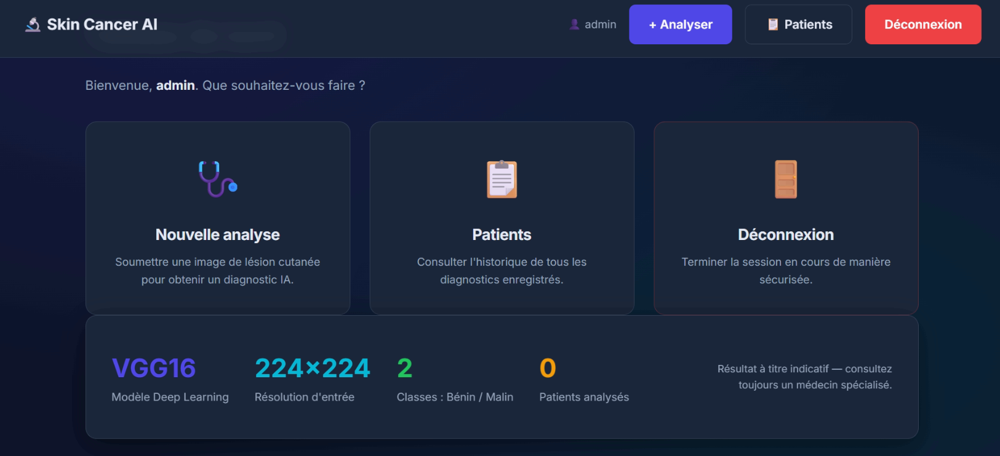
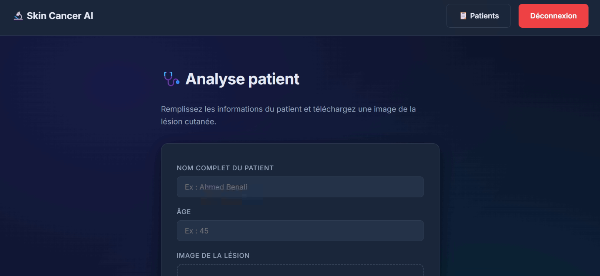
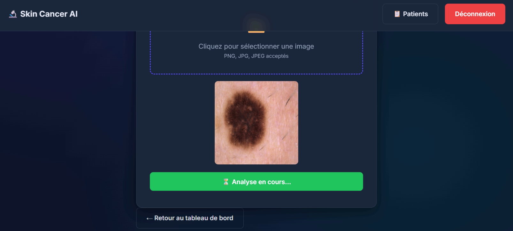
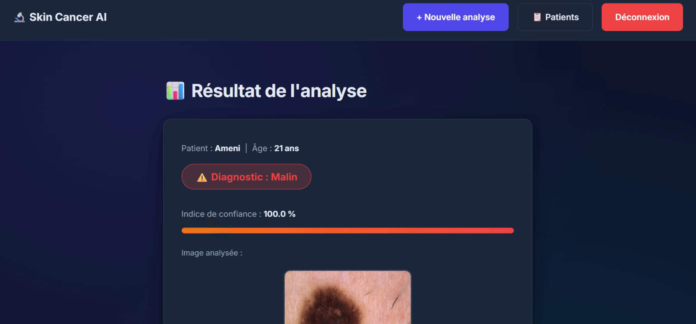
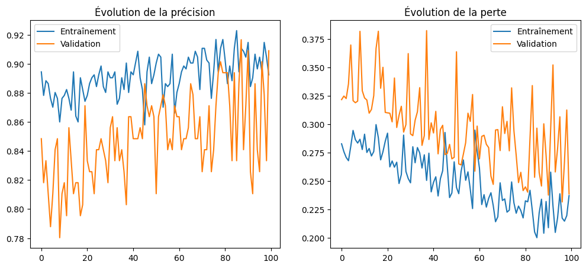
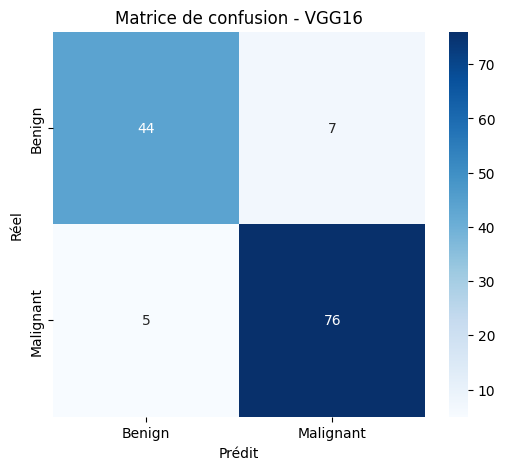
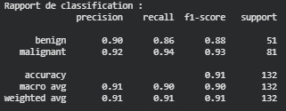

# 🔬 Skin Cancer AI — Application Web de Détection

Projet réalisé dans le cadre du **TD 8 — Développement d'une Application Web IA**  
Module : Introduction à l'IA | ENSTAB | 2025/2026  
Enseignante : Amira Echtioui

---
## 🖼️ Captures d'écran
### Page de connexion


### Connexion réussie


### Tableau de bord


### Formulaire d'analyse patient


### Analyse en cours


### Résultat de l'analyse


## 🧠 Le Modèle & Résultats

### Architecture VGG16
Le modèle est basé sur l'architecture **VGG16**, optimisée par Transfer Learning. Il analyse les caractéristiques morphologiques des lésions pour fournir un diagnostic de précision.

### 📊 Performances Réelles
Voici les résultats obtenus après l'entraînement du modèle :


*Évolution de la précision et de la perte sur 100 époques.*


*Matrice de confusion montrant la précision par classe (Bénin vs Malin).*


*Rapport détaillé des métriques (Précision, Rappel, F1-Score).*
## 📁 Structure du projet

```
projetAI/
├── app.py                  ← Application Flask principale
├── database.sql            ← Script de création de la base de données
├── requirements.txt        ← Dépendances Python
├── run.bat                 ← Script de lancement (double-clic)
├── model/
│   ├── README.txt          ← Instructions pour placer le modèle
│   └── vgg16_skin_cancer.h5 ← Modèle VGG16 (à placer ici)
├── static/
│   ├── style.css           ← Feuille de style dark-mode premium
│   └── uploads/            ← Images uploadées (créé automatiquement)
└── templates/
    ├── login.html          ← Page de connexion
    ├── dashboard.html      ← Tableau de bord avec statistiques
    ├── predict.html        ← Formulaire d'analyse patient
    ├── result.html         ← Résultat du diagnostic avec barre de confiance
    └── patients.html       ← Historique de tous les patients
```

---

## ⚙️ Installation et lancement

### Prérequis
- Python 3.12 (déjà installé)
- XAMPP (MySQL démarré)
- Fichier `vgg16_skin_cancer.h5` placé dans `model/`

### Étape 1 — Installer les dépendances
```cmd
python -m pip install -r requirements.txt
```
link vgg16:https://drive.google.com/file/d/1TxISsec70BkxmpfvA-pd6oLOxg8dswaj/view?usp=sharing

### Étape 2 — Créer la base de données
1. Ouvrir **XAMPP Control Panel** → démarrer **MySQL**
2. Aller sur `http://localhost/phpmyadmin`
3. Cliquer sur **SQL** → coller le contenu de `database.sql` → Exécuter
4. La base `skin_cancer_db` avec tables `users` et `patients` est créée

### Étape 3 — Copier le modèle
```
Placer vgg16_skin_cancer.h5 dans :
C:\Users\X13\Desktop\projetAI\model\
```

### Étape 4 — Lancer l'application

**Option A — Double-clic** sur `run.bat`

**Option B — CMD** :
```cmd
cd C:\Users\X13\Desktop\projetAI
python app.py
```

Ouvrir le navigateur : **http://127.0.0.1:5000**

---

## 🔑 Identifiants par défaut

| Champ       | Valeur  |
|-------------|---------|
| Utilisateur | `admin` |
| Mot de passe| `1234`  |

---

## 🧠 Architecture du modèle

| Paramètre       | Valeur              |
|----------------|---------------------|
| Architecture    | VGG16               |
| Résolution      | 224 × 224 px        |
| Classes         | Bénin / Malin       |
| Prétraitement   | Normalisation /255  |
| Framework       | TensorFlow / Keras  |

---

## 📱 Pages de l'application

| Page          | URL          | Description                              |
|---------------|--------------|------------------------------------------|
| Connexion     | `/`          | Authentification médecin                 |
| Dashboard     | `/dashboard` | Statistiques + analyses récentes         |
| Nouvelle analyse | `/predict` | Upload image + saisie patient           |
| Résultat      | (auto)       | Diagnostic + barre de confiance animée  |
| Patients      | `/patients`  | Historique complet avec miniatures       |

---

## ⚕️ Avertissement

> Ce système est développé à des fins **académiques uniquement**.  
> Les résultats ne remplacent pas un diagnostic médical professionnel.
